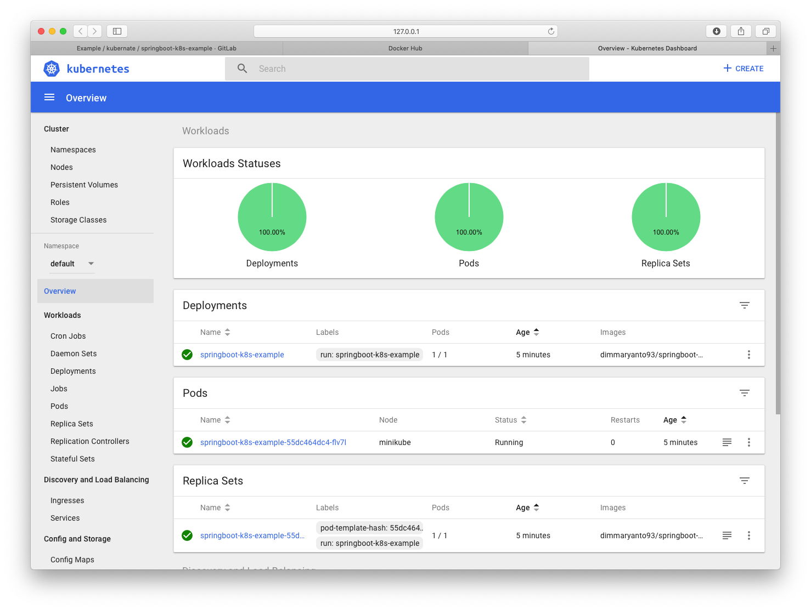
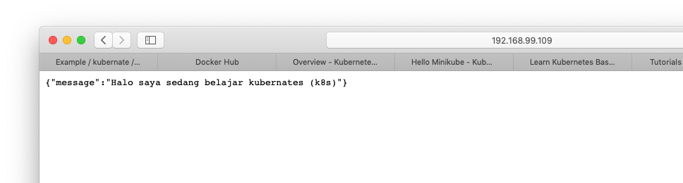

# Springboot as service in kubernate (k8s)

Untuk menjalankan springboot di container / pod kubernate kita memerlukan build image docker yang di push ke docker-registry

## Build image menggunakan maven plugin dockerfile

Berikut adalah command untuk melakukan build dan publish image ke [docker.io](https://hub.docker.com)

```bash
mvn clean package dockerfile:build dockerfile:push
```

Setelah di push make sure, image telah ter-created di hub.docker.io. contohnya pada repository berikut [dimmaryanto93/springboot-k8s-example](https://hub.docker.com/r/dimmaryanto93/springboot-k8s-example/tags)

## configure kubernate

System required: 

- [VirtualBox](https://www.virtualbox.org/wiki/Downloads)
- [docker-engine](https://docs.docker.com)
- [minikube](https://kubernetes.io/docs/setup/minikube/)

Setelah semuanya terinstall, kita jalankan service minikube dengan perintah seperti berikut:

```bash
minikube start
```

Berikut outputnya:

```bash
😄  minikube v1.0.0 on darwin (amd64)
🤹  Downloading Kubernetes v1.14.0 images in the background ...
🔥  Creating virtualbox VM (CPUs=2, Memory=2048MB, Disk=20000MB) ...
📶  "minikube" IP address is 192.168.99.109
🐳  Configuring Docker as the container runtime ...
🐳  Version of container runtime is 18.06.2-ce
⌛  Waiting for image downloads to complete ...
✨  Preparing Kubernetes environment ...
🚜  Pulling images required by Kubernetes v1.14.0 ...
🚀  Launching Kubernetes v1.14.0 using kubeadm ... 
⌛  Waiting for pods: apiserver proxy etcd scheduler controller dns
🔑  Configuring cluster permissions ...
🤔  Verifying component health .....
💗  kubectl is now configured to use "minikube"
🏄  Done! Thank you for using minikube!
```

## run service springboot into k8s

berikut perintahnya untuk merunning application springboot di kubernates:

```bash
kubectl run springboot-k8s-example --image=dimmaryanto93/springboot-k8s-example:0.0.1-SNAPSHOT --port=8080
```

Selanjutnya kita bisa check lewat kubernate-api, dengan perintah berikut:

```bash
kubectl get deployments
```

berikut outputnya: 

```bash
NAME                     READY   UP-TO-DATE   AVAILABLE   AGE
springboot-k8s-example   0/1     1            0           41s
```

Sekarang kita tinggal tunggu sampe statusnya READY, dan pastikan juga tidak ada error. selain itu juga kita bisa menggunakan ui (dashboard) dengan menggunakan command berikut: 

```bash
minikube dashboard
```

Maka tapilanya akan seperti berikut: 



## Expose port

Untuk mengakses service springboot kita perlu expose service-nya dengan perintah berikut:

```bash
kubectl expose deployment springboot-k8s-example \
--type=LoadBalancer \
--name=springboot-k8s-service-example \
--port=80 \
--target-port=8080
```

Setelah membuat service di kubernate, sekarang kita bisa view hasilnya dengan menggunakan perintahya seperti berikut:

```bash
minikube service springboot-k8s-service-example
```

berikut hasilnya: 


